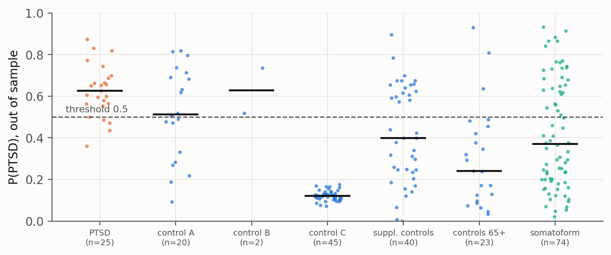
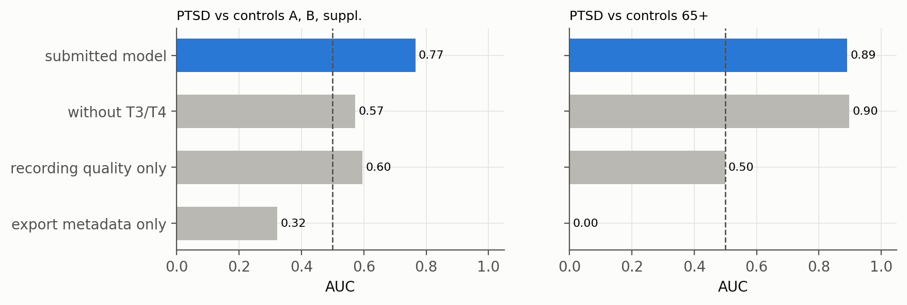
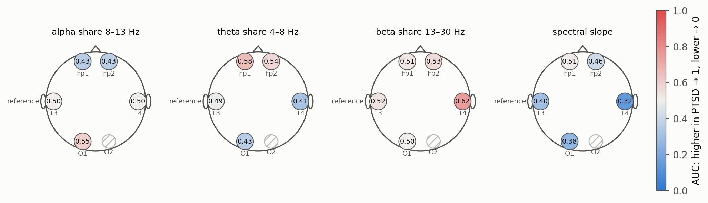

# PTSD detection from 6-channel dry EEG

[](https://github.com/igor688-hub/neurodiagnosis-eeg/actions/workflows/tests.yml)

[](LICENSE)

Hackathon solution by team **bokom-m** (September 2026): estimate the probability of post-traumatic stress disorder from one minute of resting-state EEG recorded with a 6-channel dry headset (NeuroPlay-6C: O1, T3, Fp1, Fp2, T4, O2). The submitted state, with the original Russian notebooks and report, is tagged [`v1.0-submission`](https://github.com/igor688-hub/neurodiagnosis-eeg/tree/v1.0-submission). A preprint-style write-up is in [`report/report.pdf`](report/report.pdf).

The main contribution is not the model but the audit around it: the data contain a shortcut that gives near-perfect AUC without looking at the signal, and every result below is checked against it.

## The trap in the data

Each subject was exported in one of three EDF formats, and the format almost encodes the label: all 25 PTSD patients are in format B, while 45 of 67 original controls are in format C, which has no inter-channel correlation and no occipital alpha. **The rule "format B → PTSD" reaches AUC 0.985 without any signal feature.** A high AUC is therefore not evidence of physiology, and every result is reported per stratum (cohort × export format × recording batch).

## Approach

- **Features:** 23 resting-state (eyes closed) features on O1, Fp1, Fp2, T3 and T4: relative theta/alpha/beta power, alpha peak frequency and height, aperiodic spectral slope, frontal alpha asymmetry. All are invariant to channel gain.
- **Model:** L2 logistic regression with balanced class weights and Platt calibration; the threshold is set at the equal-error point (sensitivity on PTSD = specificity on the specificity groups). Weights are stored as JSON.
- **Validation without leakage:** byte-identical recordings merge subject IDs into 221 independent groups (229 subjects). Outer loop is leave-one-group-out; feature set, regularisation, negative class and calibration are chosen only inside the fold, with a criterion that mirrors the official scoring formula. Confidence intervals: group bootstrap, 2000 resamples.
- **Pre-registration:** every protocol was fixed before it was run, and failed ones are kept ([`docs/DATA_AUDIT.md`](docs/DATA_AUDIT.md)).

## Results (out of sample, 229 subjects)

| Metric | Value [95% CI] |
| --- | --- |
| ROC-AUC, PTSD vs controls under 65 | **0.864** [0.796; 0.919] |
| ROC-AUC, PTSD vs controls A, B and supplementary batch (no format C) | 0.765 [0.661; 0.862] |
| ROC-AUC, PTSD vs controls 65+ · somatoform disorders | 0.89 · 0.79 |
| Sensitivity at P = 0.5 | 0.84 [0.69; 0.96] |
| Specificity: controls under 65 · 65+ · somatoform | 0.72 [0.64; 0.80] · 0.87 [0.74; 1.00] · 0.61 [0.50; 0.72] |



Normal ageing is separated reliably: older adults have weaker and slower alpha. Somatoform disorders are the hardest group, and clinically the closest one (anxiety, somatic arousal, frequent trauma history, similar medication).

## What the result is not explained by



| Check | Result |
| --- | --- |
| Export metadata only | AUC 0.32 vs young controls A/B, 0.00 vs 65+ |
| Recording quality only | 0.60 and 0.50 |
| Within a single export format (B) | AUC 0.84; label permutation inside format B, 60 full nested reruns: **p = 0.016** |
| Unseen batch (each control group removed from the whole procedure) | AUC drops by about 0.1 (control A 0.67 → 0.58, 65+ 0.89 → 0.82, somatoform 0.79 → 0.70) |
| Age within a batch | features do not predict age (R² ≈ 0); P is not related to age |
| Behaviour (Schulte tables) | P is unrelated to solve time; EEG + behaviour reaches 0.75 vs 0.61 and 0.64 alone |
| **Limitation:** without T3/T4 | 0.57 vs young controls A/B, 0.90 vs 65+ |

Separation from young controls relies on the temporal leads, which are the most sensitive to recording conditions; separation from older adults does not.

## Features and physiology



| Feature | Leads · band | In PTSD | Interpretation |
| --- | --- | --- | --- |
| Spectral slope | T3, T4 · 3–30 Hz | flatter | consistent with PTSD literature (Kovacevic et al., 2025); on T3 strongly batch-dependent |
| Beta share | T3, T4 · 13–30 Hz | T4 higher | shared with somatoform disorders; also a benzodiazepine EEG profile |
| Alpha share | O1 · 8–13 Hz | unchanged | separates older adults with age-related alpha decline, not a trauma marker |
| Theta share | Fp1, T3, T4, O1 · 4–8 Hz | slightly higher | reduced vigilance, sleep disturbance |
| Alpha peak frequency | O1 | unchanged | slows with age |
| Frontal alpha asymmetry | Fp2 − Fp1 | unchanged | no added value |

No feature separates PTSD specifically: the two reliably shifted features (flatter slope and more beta at T4) are shifted the same way in somatoform patients. Details: [`docs/CLINICAL_INTERPRETATION.md`](docs/CLINICAL_INTERPRETATION.md).

## Bonus: auditory response without stimulus labels

The recordings contain a metronome (2 Hz, every eighth beat deviant) but no stimulus markers. The record is folded into 4-s cycles, beat and deviant responses are separated in Fourier subspaces, the phase is searched on one half of the cycles and tested on the other, and a random-shift control repeats the whole search.

- The beat response in rest is real and frontal (p = 0.0005), as expected for auditory N1 with an ear reference.
- The method was validated on open ERP CORE data and in a hybrid simulation: the 2 Hz hardware high-pass reshapes MMN, and responses below 1.1–1.5 µV RMS are not detectable.
- The deviant response (MMN/P3a) was not confirmed in a single pre-registered test (p = 0.048 vs α = 0.025).

## How the solution evolved

| Protocol | What was tested | Key result | Conclusion |
| --- | --- | --- | --- |
| 1 | rest + task, 39 features, all channels | AUC 0.82; 0.95 vs control C, 0.51 vs control A; metadata-only model 0.97 | headline AUC is explained by format C |
| 2 | rest, no O2, ± T3/T4, spectral slope, supplementary batch | 0.82 vs controls, 0.75 vs format-B controls | within-format separation relies on T3 and the spectrum above 20 Hz |
| 3 | rest O1/Fp only, 4–20 Hz | 0.50 vs controls A/B, same as a quality-only model | honest negative: no signal in the most robust features |
| 4 | Schulte tables: behaviour and task EEG | solve-time dynamics 0.76; task EEG adds nothing | behaviour is robust, but older adults solve slower than PTSD (AUC 0.08) |
| 5 | trial-1 solve time + rest EEG | 0.66 vs all non-PTSD | behaviour kept out of the product: the task is EEG diagnostics |
| 6 | rest EEG, 229 subjects, selection by the scoring formula | 0.85 vs controls under 65 | features are not dropped on suspicion; confounders are checked separately |
| 7 | 6 + frontal alpha asymmetry, balanced calibration | 0.838, sensitivity 0.80 | asymmetry adds nothing |
| **8** | **7 + specificity-group weights, equal-error threshold** | **0.864, sensitivity 0.84, specificity 0.87 / 0.61** | **submitted** |

## Limitations

- Separation from young controls of the same format relies on T3/T4; physiology and batch differences cannot be separated there.
- Sex is not controlled: all PTSD patients are men, the somatoform group includes women.
- Cohorts differ beyond the diagnosis: combat trauma, head injury, medication and sleep are unknown. P measures similarity to the EEG of the clinical cohort, not the probability of trauma in an individual.
- All estimates come from the development data; the independent estimate is the organisers' closed test.

## Repository

```
model/          model.py (load / predict / run, retraining CLI), requirements.txt, weights/model.json
src/            preprocessing, features, models, validation, confounder and robustness checks, metronome
results/        notebooks 1–5 and validation/ with saved results of every protocol
tests/          pytest suite (runs without data; data-dependent tests are skipped)
docs/           DATA_AUDIT.md, CLINICAL_INTERPRETATION.md, TASK_SPEC.md, figures/
report/         report.pdf (preprint), presentation.pptx / .pdf
```

## Setup

Python 3.12.7.

```bash
pip install -r model/requirements.txt
```

Notebooks and tests:

```bash
pip install -r requirements-dev.txt
python -m pytest
```

Inference on a folder of subject folders (weights are loaded, no retraining):

```python
from pathlib import Path
from model.model import load, run

model = load(Path("model/weights"))
run(model, input_dir=Path("test_data"), output_path=Path("predictions.csv"))
```

File names `T-П.edf`, `T-1.edf` … are matched regardless of case and Cyrillic/Latin `Т`/`T`; empty or unreadable records are skipped, and the probability is always finite and in [0, 1].

Retraining from raw data (deterministic up to floating-point rounding):

```bash
python download_data.py --remote
python model/model.py --data-dir data --out model/weights
```

## Data and license

The EEG data belong to the hackathon organisers and are not included; `download_data.py` fetches them for participants. The code is released under the [MIT License](LICENSE).
